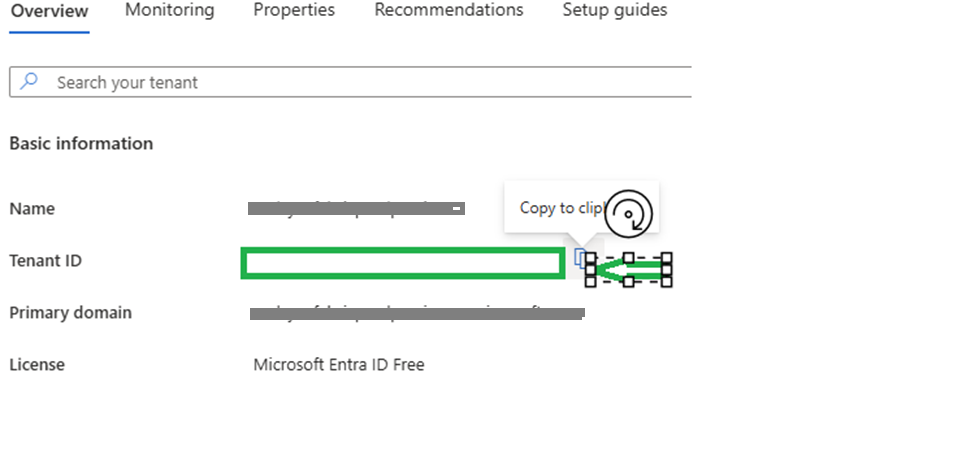
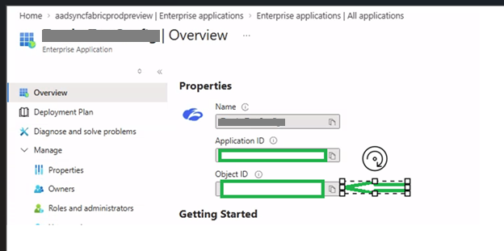

# Overview

AppRoleMove.ps1 is a PowerShell script used to manage app role assignments for an Enterprise Application (Service Principal) in Microsoft Entra ID.

The script is intended for scenarios where users or groups currently assigned Default Access need to be moved to an explicit User app role in a safe and auditable way.

# What the Script Does

## Option 1 – Fix Assignments

When Option 1 is selected, the script:

Checks whether a User app role exists on the backing App Registration

Creates the User role only if it does not already exist

Finds users and/or groups assigned Default Access

Assigns the User role to those users or groups

Removes Default Access only after the User role is successfully assigned

Generates detailed CSV and JSON reports

## Option 2 – Report Only

Makes no changes to Microsoft Entra ID

Reads current app role assignments

Generates reports for review and validation

## Dry Run (-DryRun)

When -DryRun is used with Option 1:

No Microsoft Graph write operations are performed

Role creation and assignment changes are simulated

Default Access is not removed

Reports are generated showing what would happen

# Safety and Design Principles

Existing app roles are never modified

If the User role already exists, it is reused

If a user or group already has the User role, it is skipped

Default Access is removed only after a valid User role is present

No user or group is left without access

All actions are logged and reported

# Prerequisites

## PowerShell

PowerShell 7.x or later is recommended.

## Execution Policy (Local Run Requirement)

Before running the script locally, you may need to allow script execution for the current PowerShell session only.

Run the following command in the same PowerShell window:

Set-ExecutionPolicy -Scope Process -ExecutionPolicy Bypass

This does not permanently change your system execution policy. This will be only valid for the current PowerShell session and will revert back to the default when you close the window.

## Microsoft Graph PowerShell Module

Install the Microsoft Graph PowerShell SDK if it is not already installed:

Install-Module Microsoft.Graph -Scope CurrentUser

## Required Microsoft Graph Permissions

You will be prompted to consent to the following permissions:

Application.ReadWrite.All – Manage app roles on the App Registration

AppRoleAssignment.ReadWrite.All – Assign and remove app role assignments

Directory.Read.All – Read users, groups, and assignments

You must sign in with an account that can grant admin consent.

# Required Input Values

## Tenant ID

Microsoft Entra tenant ID.

Microsoft Entra admin center → Microsoft Entra ID → Overview → Tenant ID

## Service Principal ID

This is the Object ID of the Enterprise Application (not the Application ID).

Microsoft Entra admin center → Enterprise Applications → Select applictaion → Object ID

# Script Parameters

## Required Parameters

TenantId – Microsoft Entra tenant ID

ServicePrincipalId – Object ID of the Enterprise Application

## Optional Parameters

Option – 1 (Fix assignments) or 2 (Report only)

DryRun – Preview changes without making updates

PrincipalScope – Both (default), UsersOnly, or GroupsOnly

ReportPath – Custom output folder

# How to Run the Script

Preview (Recommended First Step):

.\AppRoleMove.ps1 -TenantId <TenantId> -ServicePrincipalId <ServicePrincipalId> -Option 1 -DryRun

Execute Fix:

.\AppRoleMove.ps1 -TenantId <TenantId> -ServicePrincipalId <ServicePrincipalId> -Option 1

Report Only:

.\AppRoleMove.ps1 -TenantId <TenantId> -ServicePrincipalId <ServicePrincipalId> -Option 2

# Reports Generated

Each run generates the following files:

AppRoleMove\_<runid>.summary.json – High-level run summary

AppRoleMove\_<runid>.assignments.before.csv – Assignments before execution

AppRoleMove\_<runid>.assignments.after.csv – Assignments after execution or simulation

Always review reports after a DryRun before executing changes.

# Why Default Access Is Removed

Default Access is a system role assigned when no explicit app role exists. The script removes Default Access Assignment only after a valid User role is assigned.

This ensures explicit role-based access without breaking user access.

# Recommended Usage Flow

Run Option 1 with -DryRun

Review CSV and JSON reports

Validate changes with stakeholders

Run Option 1 without -DryRun

Retain reports for audit purposes
